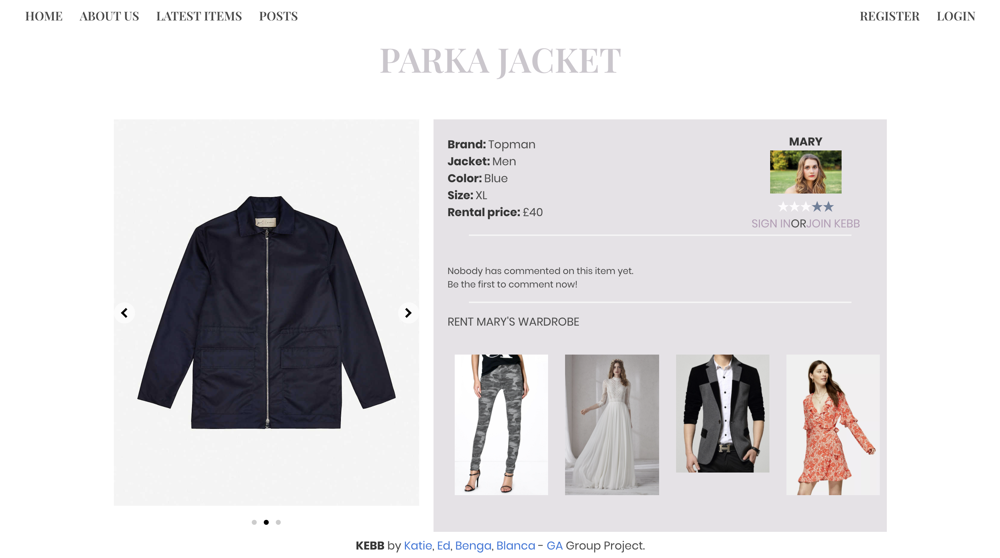
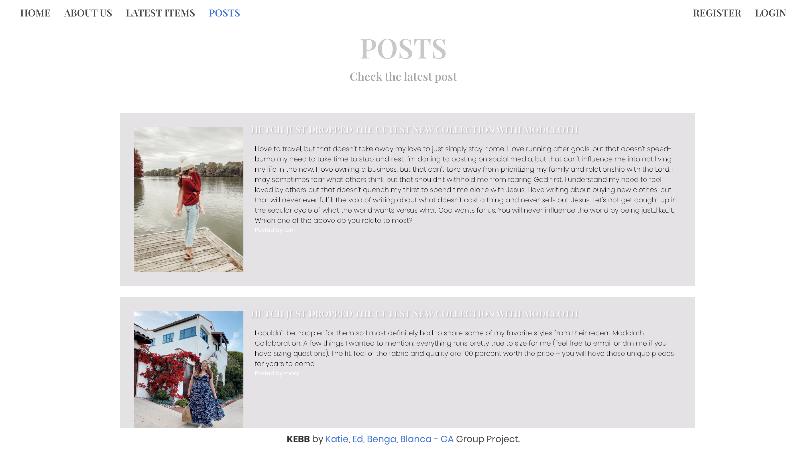
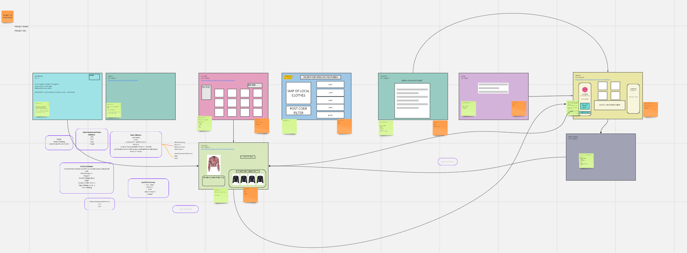

# SEI147 - PROJECT 03: A MERN Stack App 
## KEBB Bazaar - a clothes rental app 
KEBB Bazaar was a group project created in 8 days. The aim was to produce an app that incorporated everything we had learnt at GA in the previous 8 weeks.
- - - -
### Brief
* **Build a full-stack application** by making your own backend and your own front-end
* **Use an Express API** to serve your data from a Mongo database
* **Consume your API with a separate front-end** built with React
* **Be a complete product** which most likely means multiple relationships and CRUD functionality for at least a couple of models
* **Implement thoughtful user stories/wireframes** that are significant enough to help you know which features are core MVP and which you can cut
* **Be deployed online** so it's publicly accessible.
- - - -
### Technologies Used
* MongoDB
* Express
* React
* Node.js
* JavaScript (ES6) / HTML5 / SCSS
* Axios
* NPM
* Bulma
- - - -
### Approach Taken 
In our group of 4 we created KEBB Bazaar, a social site for people in London to rent out items from their wardrobe. 
The site allowed users to upload and comment on items,  post about things that they find interesting and befriend other users who’s clothes and posts they like. Each user had a map on their profile to allow them to add locations of clothes or shops they have seen that they want to go back for later. 

- - - -
### Screenshot Walk-through

1. About Us - The about us page gave an explanation about the ethos of KEBB and how the app works. It links users to register now to join KEBB if they aren’t already logged in.

2. Register Page - Users can register to join KEBB requiring them to provide a unique username and email address with matching password /password confirmation and postcode. The postcode is verified against the postcodes.io API which provides the area of London the postcode is in, used on the User Show Profile Page so other users would know where the item they are interested in is located. 

3. Logged In User Profile Page - Once users are signed in they are push to their own profile page. On registering users were allocated a random avatar as their profile picture which they could change on this page, as well as editing other aspects of their profile or deleting their profile and items they have uploaded. New messages from users came through on this page, and you were linked onto your favourites pages.

4. Pin Map - Registered users had access to a pin map, created using React Map GL. The map allowed users to save locations to revisit later. 

5. Latest Items - An index page showing all the latest items uploaded with filter and search functions to find the perfect match.

6. Clothes Show - Clicking on a latest item took you to the Clothes Show page, here you could view more details about the item, rate the item, view the user who uploaded the item and their other items available, as well as comment on the item and message the user. Clicking on one of their other items available would link you to that page. 

7.User Show Profile Page - from the clothes show page you could view the owners profile which revealed a bit more information on the user and allowed you to favourite them as a friend, message or review them.

8. Posts Page - users could add posts that they found interesting or comment on / favourite other people’s posts.

9. Favourites Page - items users have saved to go back and looks at again later 

- - - -

### Functionality
On the site the users can do the following 
* Register & Login
* Post, edit, delete your own clothing items and posts
* Post, edit, delete pins on the pin map
* Search & Filter through clothes available to find what to borrow
* Rate clothing and users, with a star rating function which took an average based on all ratings received 
* Contact users to ask to borrow their items 
* Comment on clothes, posts and users
* Favourite clothes, posts and users

- - - -

### Process
Our group spent the first day putting forward options for the project and talking through each of the proposals. Once we had collectively agreed on one we sketched up the basic layout of the app on MIRO thinking about what models and routes would be required and how we wanted the pages to look.

To work efficiently we translated the Miro wireframes onto tasks on a Trello board which allowed us to keep track of what needed doing and tick off tasks as completed.

- - - -

### Division of Work
Given we were a group of four and had gone into quite a lot of detail on the planning we agreed to split the workload with 2 members of the team focusing on backend and the other two members making a start on the frontend. We had daily stand ups every morning and another catch up after lunch to discuss progress and any problems we were having. My contribution to the project focused on the frontend with another group member, we worked separately on different functions but were on Zoom throughout so we could constantly discuss with each other and screen share quickly if we wanted to discuss the code. 

- - - -

#### Featured Piece of Code 1

The User Schema was the most complicated model as it had many other referenced models feeding into it. On sign up the User was only required to input username, email, password and postcode with all other items being added throughout use of the app.

#### Featured Piece of Code 2

We wanted to allow users to filter through the latest items to find exactly what they were looking for. The filter function was built based on the required inputs of the Clothes Schema and allowed users to filter by one or all of them, reducing the results found with each filter added. 

#### Featured Piece of Code 3

Registered users had a map which they could use to search for locations and zoom to street level. As the map viewport changed, state was constantly updated with the latitude and longitude. When a user was happy they had selected the right location they could choose to 'drop the pin', causing a modal to open with the pin form on for some details required for the pin popup which were passed upto the parent using props and submitted to the API.

#### Styling 

We imported Bulma at the start of the project ain order to get the rough layout for the pages of the app. Initially this was of great benefit as it allowed us to get a visual of the app with minimal work. As the app progressed however and we wanted to improve the styling we found the complexities of trying to override some of the Bulma styling quite time consuming. In the next project I would spend more time considering the type of finish we want first and then decide whether Bulma or another CSS framework would be a better fit, or none at all. 

- - - -

### Wins and Blockers

Using Bulma became one of the biggest blockers and consumed a lot of time towards the end trying to get things to show as we wanted. There was not enough time left for this, or for the amoutn of seeding required. 

As for wins I am very pleased with how all the pages on the front end link up. For example, from your profile you can link to see all the items and posts you have made, see friends and then view their profiles, from the clothes index you can click onto an item of clothing you like, add it to your favourites, view the users profile and befriend and message them. 

- - - -

### Future Features

If we had more time the features I would like to include are: 
* Allow multiple image upload at once when adding an item of clothing 
* A calendar on each item to show when the clothes are available for borrowing 

- - - -

### Key Learnings

This was the most complex project to date, bringing everything together and working as part of a team. Initially we had intended to allow all team members to work on all aspects of the app but as it progressed we kept the frontend and backend teams separate until the backend was finished. This was beneficial as it saved time, enabling more fetaures to be built as time wasn't wasted trying to catch up on code written by soemeone else the day before but it also meant there was less oversight across the whole project. 

