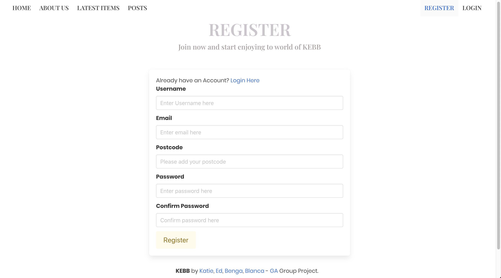
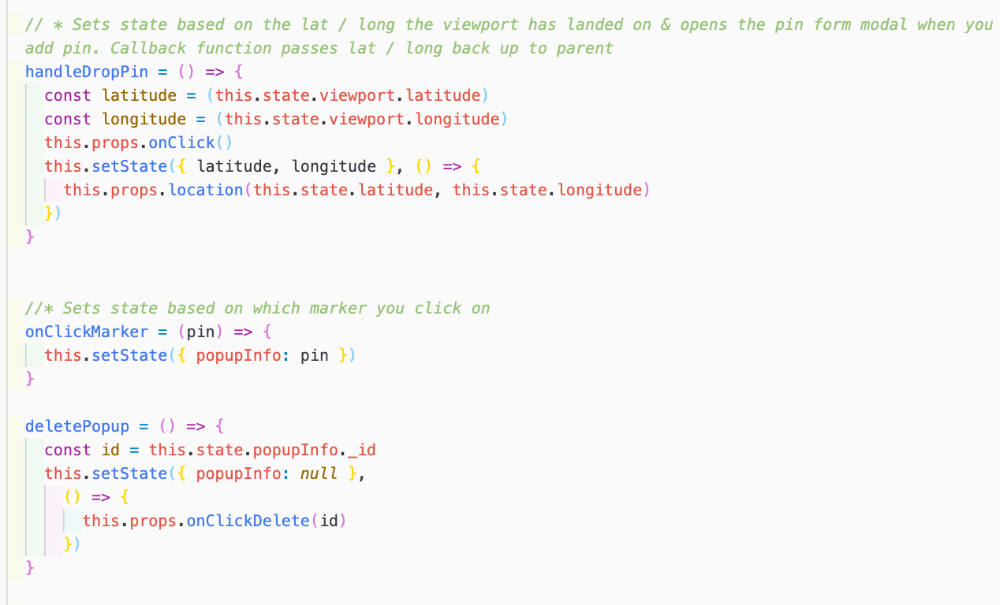

# SEI147 - PROJECT 03: A MERN Stack App 
## Overview: KEBB Bazaar - a clothes rental app 
KEBB Bazaar was a group project created in 8 days. The aim was to produce an app that incorporated everything we had learnt at GA in the previous 8 weeks.

In our group of 4 we created KEBB Bazaar, a social site for people in London to rent out items from their wardrobe to encourage people to borrow rather than buy. It allowed people to upload posts and befriend other users. Users could view items, posts and other users profiles without a token, but in order to interact with any of these things they are required to login. 

Please see a hosted version here: [KEBB Bazaar](http://kebb-bazaar.herokuapp.com/)
- - - -
### Brief
* **Build a full-stack application** by making your own backend and your own front-end
* **Use an Express API** to serve your data from a Mongo database
* **Consume your API with a separate front-end** built with React
* **Be a complete product** which most likely means multiple relationships and CRUD functionality for at least a couple of models
* **Implement thoughtful user stories/wireframes** that are significant enough to help you know which features are core MVP and which you can cut
* **Be deployed online** so it's publicly accessible.
- - - -
### Technologies Used
* MongoDB
* Express
* React
* Node.js
* JavaScript (ES6) / HTML5 / SCSS
* Axios
* NPM
* Bulma
- - - -

### Screenshot Walk-through

1. About Us - the about us page gave an explanation about the ethos of KEBB and how the app works. It links users to register now to join KEBB if they aren’t already logged in.

2. Register - users have to register to join KEBB requiring them to provide a unique username and email address with matching password /password confirmation and postcode. The postcode is verified against the postcodes.io API which provides the area of London the postcode is in, used on the User Show Profile Page, so other users would know where the clothes are located. 

3. Profile Page - once users are signed in they are pushed to their profile page. On registering users were allocated a random avatar as their profile picture which they could change on this page, as well as editing and deleting other aspects of their profile and items they had uploaded. New messages from other users come through on this page which you can reply to. Users can access their favourites pages from here.

4. Pin Map - registered users had access to a pin map, created using React Map GL. The map allowed users to search for and save locations to revisit later. 

5. Latest Items - an index page showing all the latest items uploaded with filter and search functions to find the perfect match.

6. Clothes Show Page - clicking on a latest item takes you to the Clothes Show page for that item, here you can view more details about the item, rate the item, view the user who uploaded the item and their other items available, as well as comment on the item and message the user, if logged in.  

7. User Show Profile Page - users can view the owner of an items profile which revealed a bit more information on them. From here you can favourite them as a friend, message or review them if you are logged in.

8. Posts Page - users can add posts that they found interesting or comment on / favourite other people’s posts.

9. Favourites Page - items users have saved to go back and looks at again later 

- - - -

### Functionality

On the site the users can do the following:

* Register & Login
* Post, edit, delete your own clothing items and posts
* Post, edit, delete pins on the pin map
* Search & Filter through clothes available to find what to borrow
* Rate clothing and users, with a star rating function which took an average based on all ratings received 
* Contact users to ask to borrow their items 
* Comment on clothes, posts and users
* Favourite clothes, posts and users

- - - -

### Process
Our group spent the first day putting forward options for the project and talking through each of the proposals. Once we had collectively agreed on one we sketched up the basic layout of the app on MIRO thinking about what models and routes would be required and how we wanted the pages to look.

To work efficiently we translated the Miro wireframes onto tasks on a Trello board which allowed us to keep track of progress.

#### Division of Work
Given we were a group of four and had gone into quite a lot of detail on the planning we agreed to split the workload with two members of the team focusing on backend and the other two members making a start on the frontend. We had daily stand ups every morning and another catch up after lunch to discuss progress and any problems we were having. 

My contribution to the project focused on the frontend with another group member, we worked separately on different pages but were on Zoom throughout so we could constantly discuss with each other and screen share quickly if we wanted to discuss the code. I worked on the About Page, Login & Register Forms, User Profile, Edit and Delete, User Map, Clothes Add and Edit pages.

- - - -

#### Featured Piece of Code 1

The User Schema was the most complicated model as it had many other referenced models feeding into it. On sign up the User was only required to input username, email, password and postcode with all other items being added throughout use of the app.

#### Featured Piece of Code 2

We wanted to allow users to filter through the latest items to find exactly what they were looking for. The filter function was built based on the required inputs of the Clothes Schema and allowed users to filter by one or all of them, reducing the results found with each filter added. 

#### Featured Piece of Code 3

Registered users had a map which they could use to search for locations and zoom to street level. As the map viewport changed, state was constantly updated with the latitude and longitude. When a user was happy they had selected the right location they could choose to 'drop the pin', causing a modal to open with the pin form on for some details required for the pin popup which were passed upto the parent and submitted to the API.

#### Styling 

We imported Bulma at the start of the project for ease in achieving page layouts. Initially this was of great benefit as it allowed us to get a visual of the app with minimal work. As the app progressed however and we wanted to improve the styling we found the complexities of trying to override some of the Bulma styling quite time consuming. In the next project I would spend more time considering the type of finish we want first and then decide whether Bulma or another CSS framework would be a better fit, or none at all. 

- - - -

### Wins and Blockers

The biggest win is the amount of functionality the app has and how all the pages link up, with different aspects on pages appearing different depending whether you are logged in or not.

The two biggest blockers were using Bulma and the amount of seeds required to show the app's full potential. Bulma consumed a lot of time towards the end of the project fighting against it to try to get things to show as we wanted. Given the nature of the site all of the features needed seeding which was also very time consuming.

- - - -

### Future Features

If we had more time the features I would like to include are: 
* Allow multiple image upload at once when adding an item of clothing 
* A calendar on each item to show when the clothes are available for borrowing 

- - - -

### Key Learnings

This was the most complex project to date, bringing everything together and working as part of a team. Initially we had intended to allow all team members to work across both the front and backend of the app but as time progressed we decided to keep the frontend and backend teams separate until the backend was finished. This was beneficial as it saved time but it also meant there was less oversight across the whole project. 

